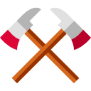
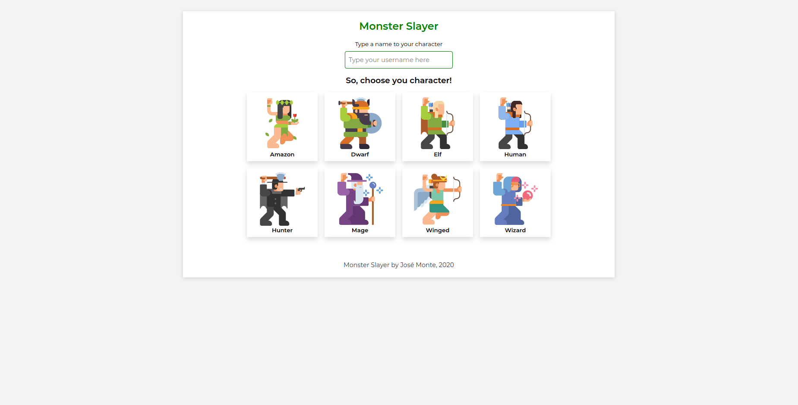
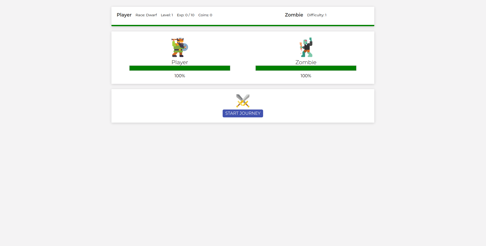
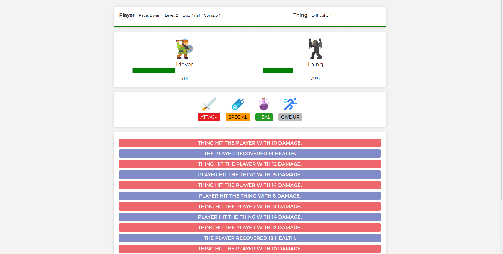
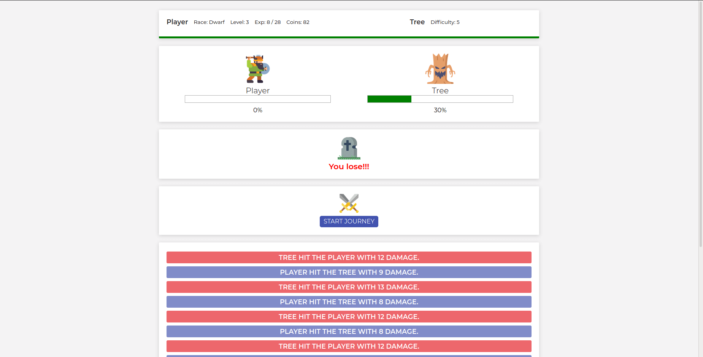
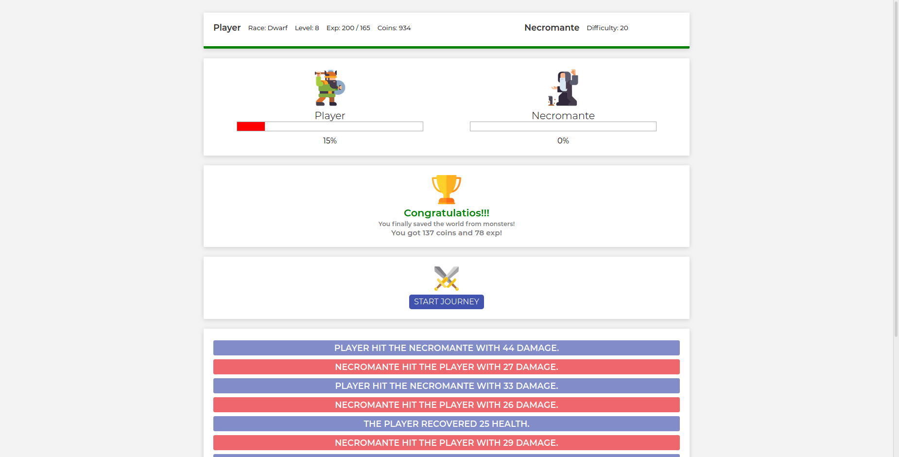

<p id="logo" align="center">
    
</p>

<h1 align="center">Monster Slayer</h1>

<p align="center">Derrote todos os monstros e salve o dia!</p>

<div align="center">
    
    <space></space>
    
    <space></space>
</div>

<br>

<h4 align="center"> 
	🚧  Projeto em desenvolimento...  🚧
</h4>

## Tabela de conteúdos
<!--ts-->
   * [Overview](#overview)
   * [Tecnologias](#tecnologias)
   * [Features](#features)
   * [Features Adicionadas](#features-adicionadas)
   * [Obtendo o projeto](#obtendo-o-projeto)
   * [Visualizando o projeto](#visualizando-o-projeto)
   * [Melhorias sugeridas](#melhorias-sugeridas)
   * [Autor](#autor)
   
<!--te-->

## Overview

O "Matador de Monstros" é o Projeto #01, presente na Seção 4 do [Curso Vue JS 2 - O Guia Completo (incl. Vue Router & Vuex)](https://www.udemy.com/course/vue-js-completo/).  

O projeto foi desenvolvido utilizando o Vue.JS através de CDN e tem como intenção oferecer um contato inicial com o Vue.JS, abrangendo todo o conteúdo visto durante as Seções 1, 2 e 3 do curso. Algumas melhorias foram adicionadas no projeto e estão descritas na seção [Features Adicionadas](#features-adicionadas) deste README. Também existem algumas possíveis melhorias que são citadas na seção [Melhorias sugeridas](#melhorias-sugeridas) que podem ser implementadas futuramente.

Ir para o [topo](#logo).

## Tecnologias
As seguintes tecnologias foram usadas na construção do projeto:

- [Vue.JS](https://vuejs.org/)
- [HTML](https://developer.mozilla.org/pt-BR/docs/Web/HTML)
- [CSS](https://developer.mozilla.org/pt-BR/docs/Web/CSS)

Ir para o [topo](#logo).

## Features

- [x] Vue CDN
- [x] Vue Lifecycle (created)
- [x] Computed Properties
- [x] Watch

## Features adicionadas

- [x] Adição de imagens
- [x] Menu Inicial
- [x] Nível de experiência para o player
- [x] 20 Níveis de dificuldades para os monstros
- [X] Drop de experiência e dinheiro dos monstros

Ir para o [topo](#logo).

## Obtendo o projeto

Abra um terminal de comandos na pasta onde deseja salvar o projeto e digite o comando abaixo:

```git
$ git clone https://github.com/jmontejr/monster-slayer.git
```

Ou baixe o arquivo comprimido diretamente do repositório do projeto no Github e descompacte onde desejar.


Ir para o [topo](#logo).

## Visualizando o Projeto

Para visualizar o projeto basta acessar o [link do jogo](https://jmontejr.github.io/monster-slayer) ou assim que for realizado o clone do repositório, acessar a pasta onde o projeto foi baixado e abrir o arquivo `index.html` no seu navegador de costume.

### 01- Menu
<p align="center">
    
</p>

### 02- Tela inicial
<p align="center">
    
</p>

### 03- Batalha
<p align="center">
    
</p>

### 04- Tela de derrota
<p align="center">
    
</p>

### 05- Vitória / Fim de Jogo
<p align="center">
    
</p>

Ir para o [topo](#logo).


### Melhorias Sugeridas

- Recriar o projeto usando o Vue CLI
- Criar componentes de acordo com o que o projeto demanda
- Criar opção para salvar o progresso do jogo de onde parou (uma sugestão é utilizar o localStorage)
- Limitar o uso de ataques especiais e de cura
- Criar uma função de Loja/Comércio onde o jogador poderá repor seus ataques especiais e poções de cura utilizando as moedas (coins) que adquiriu ao longo das batalhas


Ir para o [topo](#logo).
### Autor

<h2>José Monte</h2>
<p>Desenvolvido com :heart:</p>
<div>
    <a href="https://jmontejr.github.io">
        
    </a>
    <space></space>
    <a href="https://www.linkedin.com/in/jmontejr">
        
    </a>
    <space></space>
    <a href="https://codepen.io/jmontejr">
        
    </a>
</div>

Ir para o [topo](#logo).
